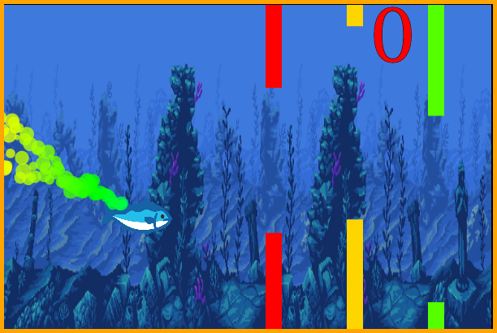

# Flappy Tainha

A flappy-bird like game about a wild tainha trying to survive

# What is "Tainha" ?

Its a well-known fish on the Brazilian coast

# How to play ?

- https://camilabodack.github.io/flappy-tainha/

Or:

1. Clone this repository
2. Open flappy.html with a browser (tested with firefox and chrome)
3. Use SPACE to jump over obstacles.

## References:

Background image Artwork created by Luis Zuno (@ansimuz)
